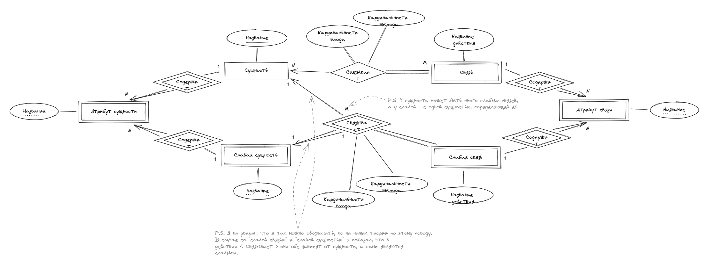

# Интеллектульный анализ данных
Данный репозиторий относится к серии лекций и семинаров, которые я прохожу на программе "Интеллектуальный Анализ Данных" в Высшей школе экономики.

# SQL - 3 семестр 
Курс по базам данных имел два потока обучения: 
1. Python для разработки 
2. Базы данных 

В данном курсе изучалась работа с базами данных и их запуск на сервере в виде Docker-контейнеров. 
В дополнение к данному курсу я изучал Nest.js для написания CQRS, MVC и микросервисных приложений на Typescript. 

На курсе проходились: 
1. История баз данных 
2. Проектирование баз данных 
3. Язык SQL в реализации PostgreSQL
4. Запросы к базам данных
5. Нормализация и оптимизация 
6. Контейнеризация 

Результаты выполнения домшних заданий: 
1. Проектирование БД - 
2. [Описание структур данных](./SQL/Task%202.md)
3. [Базовые запросы](./SQL/Task%203.md)
4. [Группировки и окна](./SQL/Task%206.md)
5. [JOIN + GROUPBY](./SQL/Task%207.md)
6. [Нормализация](./SQL/Task%208.md)
7. [Мониторинг производительности](./SQL/Task%209.md)
8. [Экзамен - Архитектура БД](./SQL/Exam.md)

# Введение в машинное обучение - 4 семестр 
В данном курсе изучались основы машинного обучения. Акцент был сделан на деревьях, кластерах и логистической регрессии. 
Были пройдены следующие темы: 
1. Введение в машинное обучение и анализ данных.
2. Виды задач и виды признаков. Метод k ближайших соседей для классификации. Вычисление расстояний для числовых данных.
3. Измерение ошибки в задачах классификации. Обобщающая способность. 
4. Проверка обобщающей способности: отложенная выборка и кросс-валидация. Метод k ближайших соседей.
5. Модель линейной регрессии. Подготовка данных для линейной регрессии. Переобучение и регуляризация линейных моделей.
6. Линейная регрессия и градиентный спуск.
7. Функции потерь в регрессии. Линейная классификация.
8. Метрики качества классификации.
9.  Логистическая регрессия и метод опорных векторов.
10. Метод опорных векторов, многоклассовая классификация.
11. Решающие деревья.
12. Решающие деревья. Композиции моделей.
13. Градиентный бустинг.
14. Градиентный бустинг. (продолжение). Отбор признаков.

В рамках обучения были выполнены работы: 
1. [Библиотека Numpy](./ML%20-%20Intro/hw01-numpy.ipynb)
2. [Библиотека Pandas](./ML%20-%20Intro/hw02-pandas.ipynb)
3. [Подготовка данных](./ML%20-%20Intro/hw03-EDA.ipynb)
4. [Линейные модели](./ML%20-%20Intro/hw04-knn-linreg.ipynb)
5. [Градиентный спуск](./ML%20-%20Intro/hw05-grad.ipynb)
6. [Обучение на тексте](./ML%20-%20Intro/hw06-texts.ipynb)
7. [Решающие деревья](./ML%20-%20Intro/hw07-trees-rf.ipynb)
